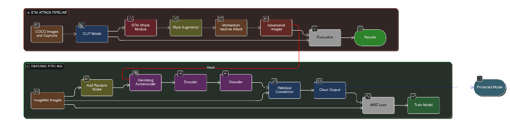

# STM Attack and Defense Evaluation

## Introduction

This project explores adversarial robustness by leveraging the **Style Transfer Method (STM)** to improve the transferability of adversarial examples, particularly during this project we will be targeting multimodal models and trying Magnet Defence on the attack and evaluating results for both settings.

---

## Overview of the STM Paper

The paper *"Improving the Transferability of Adversarial Examples with Arbitrary Style Transfer"* introduces the **Style Transfer Method (STM)** [7], addressing the limitations of previous input diversity techniques.

STM leverages **arbitrary style transfer networks** to generate stylized images from various domains, thereby:
- Increasing input diversity
- Preserving semantic content
- Maintaining label consistency for stylized inputs
- Adding random noise to further enhance diversity

Extensive experiments on ImageNet-compatible datasets demonstrate that STM significantly outperforms previous input transformation-based attacks, especially against adversarially trained and defended models.  
These results highlight the **critical role of domain diversity and semantic preservation** in crafting robust and highly transferable adversarial examples.

---

## Novelty: STM Attack Evaluation for Multimodal Models

**Evaluation Results (over 500 images):**
- **Average Cosine Similarity (Original)**: 0.3099
- **Average Cosine Similarity (Adversarial)**: 0.2047
- **Similarity Drop**: 0.1052
- **Attack Success Rate (ASR, margin=0.1)**: 0.5260

---

## Final Results of Defense

| Metric                           | Result |
|-----------------------------------|--------|
| Accuracy Without Attack           | 95%    |
| Accuracy With Attack              | 0.5%   |
| Accuracy With Variation of Magnet | 0.80%  |

---

## Conclusion

These results demonstrate:
- The **high quality** of adversarial noise generated by STM.
- The STM Attack with little bit of tweak can be extended to multimodal settings
- The **failure of standard defense techniques** against such attacks.
- The **necessity of using specific style-based defense strategies** to protect multimodal models effectively.
---

